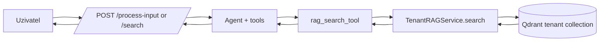
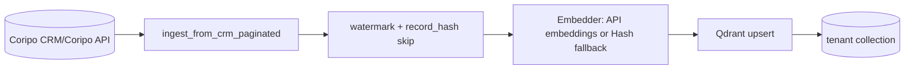

# Datový a integrační model s využitím RAG (aktuální implementace v `talk2crm`)

Tento dokument popisuje **reálně implementovaný** stav v projektu `talk2crm` podle kódu v:
- `app/engine/rag.py`
- `app/api/endpoints.py`
- `app/services/crm_client.py`
- `app/engine/tools.py`

## 0) Ověření osnovy: co sedí a co je potřeba upravit

Tvoje osnova je velmi dobrá jako struktura kapitoly, ale několik bodů je nutné upravit podle skutečné implementace.

| Bod osnovy | Stav vůči kódu | Poznámka |
|---|---|---|
| RAG architektura, motivace, tok dotazu | Sedí | Implementováno přes `TenantRAGService` + nástroje agenta |
| Inkrementální ingest + watermarky | Sedí | `ingest_from_crm_paginated()` + `_latest_module_modified_at()` |
| Qdrant multi-tenancy | Sedí | Kolekce per tenant: `<prefix>__<tenant>` |
| Metadata a filtrování | Částečně sedí | Metadata jsou v payloadu; search není postavený na bohatých filtrech typu `user_id` |
| `ndjson.gz` snapshoty v `var/lake` | Nesedí | V aktuálním kódu nejsou |
| Přímá cesta z MySQL -> vektor DB | Nesedí | Data jdou přes CRM API (`execute_module_action list`), ne přímo SQL dump |
| SentenceTransformers `all-MiniLM-L6-v2` | Nesedí | Aktuálně OpenAI-compatible `/embeddings` endpoint (`rag_embedding_model`), fallback `HashEmbedder` |
| 384 dimenzí embeddingu | Nesedí (výchozí) | Výchozí `rag_embedding_size=2560` (konfigurovatelné) |
| FAISS lokální index | Nesedí | V repozitáři není FAISS implementace |
| RapidFuzz/Levenshtein | Nesedí | Použitý je `difflib.SequenceMatcher` + vlastní fuzzy token heuristika |

---

## 4.1 Architektura RAG (Retrieval-Augmented Generation)

### 4.1.1 Princip a motivace
- LLM není zdroj pravdy pro aktuální CRM data.
- RAG vrstva poskytuje tenantově izolované vyhledání relevantních CRM záznamů a vrací je jako kontext.
- V systému je RAG pomocná vrstva: autoritativní CRUD pravda je stále CRM backend.

### 4.1.2 Komponenty RAG v `talk2crm`
- `TenantManager` načte tenant credentials.
- `CoripoClient` čte CRM data přes API.
- `TenantRAGService` řeší ingest, embedding a search v Qdrantu.
- Agent (`run_agent`) používá nástroj `rag_search_tool` pro entity lookup.

### Tok dotazu (runtime)


---

## 4.2 Pipeline pro integraci a ingestaci dat

### 4.2.1 Extrakce dat (aktuální stav)
Aktuální implementace nepoužívá `ndjson.gz` snapshoty ani `var/lake`.

Data se čtou stránkovaně přes CRM API:
- `crm_client.execute_module_action(module, action="list", data={offset, max_results, include_hash...})`
- moduly defaultně: `Contacts`, `Accounts`, `Meetings` (lze rozšířit)

Ingest endpoint:
- `POST /rag/ingest/`
- režim `synchronous=true` nebo background tasky

### 4.2.2 Inkrementální aktualizace (watermark)
Mechanismus je realizován takto:
1. Z existující tenant kolekce se zjistí nejnovější `modified_at` pro daný modul (`_latest_module_modified_at`).
2. Při čtení CRM stránek se berou jen záznamy s `modified_at >= watermark`.
3. Ingest končí při dosažení starších záznamů (`reached_existing`).

Dále probíhá skip beze změny přes hash:
- point ID je deterministické: `uuid5(tenant_id:module:record_id)`
- payload drží `record_hash`
- pokud je hash stejný jako v Qdrantu, záznam se nepřegeneruje

### 4.2.3 Čištění a příprava dat
V aktuálním kódu není ruční concat typu „jméno + příjmení + firma“.

Používá se:
- serializace celého recordu do JSON (`json.dumps(..., sort_keys=True)`)
- lehká normalizace `_clean_embed_text()` (např. zkrácení dlouhých Teams URL)

---

## 4.3 Vektorizace a sémantické embeddingy

### 4.3.1 Použitý model (aktuální stav)
Není zde napevno `SentenceTransformers all-MiniLM-L6-v2`.

Aktuální cesta:
- `OllamaEmbedder` posílá požadavek na OpenAI-compatible `/embeddings` endpoint
- model je konfigurován přes `rag_embedding_model` (výchozí v configu: `qwen3-embedding:4b`)
- při chybě se použije fallback `HashEmbedder`

### 4.3.2 Prostor embeddingu
Dimenze je konfigurovatelná:
- `rag_embedding_size`
- výchozí hodnota v repozitáři: `2560`

### 4.3.3 Deterministické hashování (local dev fallback)
`HashEmbedder`:
- rozdělí text na chunk-y po 128 znacích
- pro každý chunk použije SHA-256 digest
- mapuje digest do vektoru délky `rag_embedding_size`
- výstup L2 normalizuje

Výhoda: rychlý deterministic fallback bez externího model serveru.

---

## 4.4 Indexace a správa vektorového úložiště

### 4.4.1 Qdrant a multi-tenancy
Každý tenant má vlastní kolekci:
- formát: `<QDRANT_COLLECTION>__<tenant_id_sanitized>`
- sanitizace + zkrácení dlouhých názvů s hash suffixem

Tím je zajištěná storage-level izolace mezi tenanty.

### 4.4.2 FAISS (poznámka)
V aktuální implementaci FAISS není.

Pokud chceš FAISS uvést v práci, je lepší to psát jako:
- možná alternativa / budoucí rozšíření
- nikoli jako „aktuálně implementovaný subsystém“

### 4.4.3 Metadata a filtrování
Payload v Qdrantu obsahuje:
- `tenant_id`, `module`, `record_id`, `record_hash`, `modified_at`, `text`, `record`

Search flow v `TenantRAGService.search()`:
1. textový pass (`MatchText` nad `text`) 
2. vektorový pass (cosine)
3. merge: text results first, pak vektorové výsledky bez duplicit

---

## 4.5 Hybridní vyhledávání v českém prostředí

Hybridní logika je ve dvou vrstvách:

1. **RAG vrstva (`rag.py`)**
- keyword `MatchText` + vector similarity merge

2. **Tool vrstva (`tools.py`)**
- česká normalizace textu (lowercase, odstranění diakritiky)
- fuzzy token varianty (např. koncovky)
- `SequenceMatcher` pro lexical similarity
- domain heuristiky pro account/contact výběr

### 4.5.1 Limity čistě sémantiky
Pro jména, zkratky a české tvary může samotný vektorový search vracet horší top hit.

### 4.5.2 Lexikální složka (aktuální implementace)
Není `RapidFuzz`. Je použito:
- `_score_lexical_fuzzy(query, candidate)`
- `SequenceMatcher(None, q, c).ratio()`
- token overlap po normalizaci a jednoduchém stemming-like ořezu suffixů

### 4.5.3 Re-ranking (aktuální implementace)
V kódu je několik scoring kroků. Pro firmy (`_score_account_candidate`) je prakticky:

\[
S_{final} = S_{name} + B_{rag}
\]

kde:
- \(S_{name}\) je lexikální shoda z `_score_text_match` (0–100)
- \(B_{rag} = \min(10, \lfloor 10 \cdot S_{rag} \rfloor)\)
- \(S_{rag}\) je Qdrant score (typicky cosine podobnost)

Pro recent kontakty:
\[
S = \max(100 \cdot S_{lexical\_fuzzy},\ S_{token})
\]

---

## 4.6 Evaluace přesnosti vyhledávání

V kódu nejsou zabudované oficiální metriky typu offline benchmark pipeline pro HitRate@k.

Co je aktuálně dostupné:
- integrační testy toolů
- skript `scripts/validate_contacts_ingest.py` pro kontrolu pokrytí CRM vs Qdrant

Doporučení pro tuto kapitolu:
- doplnit vlastní eval dataset (dotaz -> očekávaný record_id)
- měřit HitRate@1/3/5 pro:
  - vektor-only
  - text-only
  - aktuální hybrid (text+vector+tool re-rank)

---

## Praktické přílohy do práce

### A) Příklad transformace dokumentu pro embedding

**CRM record (zjednodušeně):**
```json
{
  "id": "105004f2-f220-2bbb-2ca0-64e330763f18",
  "first_name": "Jan",
  "last_name": "Novák",
  "account_name": "Acmark s.r.o.",
  "email1": "jan.novak@example.cz",
  "date_modified": "2026-04-20 09:12:33",
  "_record_hash": "..."
}
```

**Text pro embedding (aktuálně):**
- serializovaný JSON celého recordu (seřazené klíče)
- po `_clean_embed_text()`

```text
{"account_name":"Acmark s.r.o.","date_modified":"2026-04-20 09:12:33","email1":"jan.novak@example.cz","first_name":"Jan","id":"105004f2-f220-2bbb-2ca0-64e330763f18","last_name":"Novák"}
```

### B) Snippet ingest logiky (pagination + watermark)

```python
watermark = self._latest_module_modified_at(tenant_id=tenant_id, module=module) if incremental else None

while True:
    payload = await crm_client.execute_module_action(
        module=module,
        action="list",
        data={"offset": offset, "max_results": current_size, "include_hash": True},
    )
    records = self._extract_records(payload)

    if watermark is None:
        selected_records = records
    else:
        selected_records = []
        reached_existing = False
        for record in records:
            modified_at = self._record_modified_at(record)
            if modified_at is None or modified_at >= watermark:
                selected_records.append(record)
            else:
                reached_existing = True

    inserted = await self.ingest_records(..., records=selected_records)
    if watermark is not None and reached_existing:
        break
```

### C) Diagram ingest toku



### D) FAISS vs Qdrant (pro text práce)

| Kritérium | Qdrant (aktuálně v projektu) | FAISS |
|---|---|---|
| Stav v `talk2crm` | Implementováno | Neimplementováno |
| Multi-tenancy | Nativně řešeno přes kolekce per tenant | Nutné řešit aplikačně |
| Metadata payload/filter | Ano | Omezené, nutná vlastní vrstva |
| Persist/serving | Serverové API, snadné nasazení | Často embedded knihovna |
| Vhodnost pro tuto app | Vysoká | Spíše alternativa pro jiné scénáře |

---

## Doporučená upravená osnova kapitoly 4

1. Architektura RAG v `talk2crm`
2. Ingest pipeline z CRM API do Qdrant (pagination, watermark, hash skip)
3. Embedding vrstva (konfigurovatelný model + Hash fallback)
4. Qdrant indexace a tenant izolace
5. Hybrid retrieval: text+vector v `rag.py` + fuzzy re-rank v `tools.py`
6. Evaluace a měření (doplněná experimentální část)

Tato verze je plně konzistentní s aktuálním kódem.
